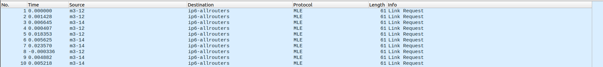
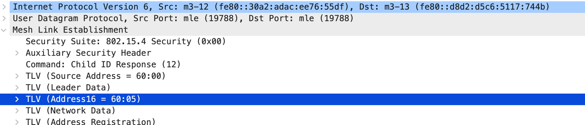

# Rapport TP2 - IOT

## 1. Compilation

Pour commencer on compile les firmwares FTD et MTD sur le channel 12 avec le PANID `0x12f0/`

```bash
$ iotlab-auth -u iot2023stras6
$ git clone https://github.com/RIOT-OS/RIOT.git
$ cd RIOT
$ git checkout 2022.07
$ cd examples/openthread
$ source /opt/riot.source
$ make BOARD=iotlab-m3 OPENTHREAD_CHANNEL=12 OPENTHREAD_PANID=0x12f0 OPENTHREAD_TYPE=ftd
$ cp bin/iotlab-m3/openthread.elf openthread-ftd.elf
$ source /opt/riot.source
$ make BOARD=iotlab-m3 OPENTHREAD_CHANNEL=12 OPENTHREAD_PANID=0x12f0 OPENTHREAD_TYPE=mtd
$ cp bin/iotlab-m3/openthread.elf openthread-mtd.elf
```

Les deux binaires sont maintenant trouvable dans `~/RIOT/examples/iotlab-m3`.

## 2. Déploiement du réseau

Une fois les 5 noeuds déployés avec les bon firmawares (2 sur FTD et 3 sur MTD), on peut leur définir leur masterkey :

```bash
$ serial_aggregator
$ ifconfig down
$ thread stop 
$ masterkey 00cafedeca00deadbeaf00deafbee000
$ ifconfig up
$ thread start 
```

On va pouvoir sniffer le réseau afin de comprendre le fonctionnement de :

1. l'election du leader
2. l'election des parents sur les noeuds End-Device
3. l'attribution des adresses (RLOC, IPv6)

Pour cela :

```bash
$ ssh iot-lab sniffer_aggregator -i 382202 -r -d -o - | wireshark -k -i -
```

On renseigne égallement la clé de décryptage `masterkey : 00cafedeca00deadbeaf00deafbee000` dans wireshark. 

### 1. Élection du leader

Dès leur allumage, les noeuds de type FTD (chez nous`m3-12` et `m3-14`) commencent à broadcast leur `Link request` pour s'annoncer à l'autre FTD.



Chaque routeur leader (chez nous `m3-14`) répond à l'autre FTD avec avec un `Link Request + Link Accept`.


Pour finir, le routeur non leader (chez nous, `m3-12`) valide l'élection avec un `Link Accept`. 

### 2. Élection des parents sur les noeuds End-Device

L'élection des parents est assez similaire à l'élection du leader. 

Dès leur allumage, les noeuds de type MTD (chez nous `m3-10`,`m3-11` et `m3-13` )  commencent à broadcast leur `Parent request` pour s'annoncer aux FTD.

Dans les captures d'écran suivantes, nous verrons l'établissement du lien entre `m3-11` et le routeur `m3-14`.


Ensuite, les routeurs ayant reçu la `Parent request` répondent au MTD avec un `Parent response`. 


Ensuite, le noeud MTD renvoie au parent qu'il aura choisi un `Child ID request` pour récupérer un identifiant. 


Et pour finir, le FTD élu comme parent répondra avec un `Child ID response` pour donner le nouvel identifiant à l'enfant.


### 3. Attribution des adresses (RLOC, IPv6)

Lors de l'envoi du `Child ID Request` le MTD demande l'adresse `RLOC16` au routeur :


Lors de l'envoi du `Child ID Response` à son enfant, le FTD fourni une adresse `RLOC16` au MTD :



## 3. Plan du réseau

Grace aux commandes `status ` et `child table` ainsi qu'avec les captures, on peut représenter le schéma de réseau suivant :


On peut constater que les noeuds `m3-10` et `m3-13` ne se sont pas appareillés avec le leader `m3-14`, mais avec le second routeur `m3-12`. Cela peut s'expliquer simplement : la connection entre `m3-14` et  `m3-10`/`m3-13` est sans doute plus difficile, à cause des perturbations radios, ou de la distance entre eux par exemple. Et en effet, en faisant des tests avec `ping` on constate que les temps de réponses sont significativement plus lent entre `m3-14` et  `m3-10`/`m3-13`  que entre `m3-12` et  `m3-10`/`m3-13`.

## 4. ICMPv6

> **Note:** À partir de là, le travail à été effectué sur  d'autres noeuds, il est normal si les addresses ou les identifiants sont différents par rapport à la première partie du rapport.

Le connectivité entre nos noeuds est parfaitement fonctionnelle. 

La commande suivante permet de pinger un de nos noeuds :

```bash
$ nc m3-10 20000
```

Le résultat est visible dans la capture wireshark :


## 5. Connectivité UDP (CoAP)

Pour commencer, on doit créer la ressource :


La seconde étape est de récuperer la ressouce :


La capture wireshark nous montre que le transfert UDP CoAP c'est déroulé sans encombre :


On constate aussi que les messages ne sont pas assez long pour nécessiter une fragmentation. Ils ont néanmoins été émis plusieurs fois.

## 6. Changement de leader

Dans cette question, on considérera la structure suivante :


Pour commencer on éteint le noeud leader `m3-55`.

On remarque que le second FTD, le noeud `m3-57` envoie plusieurs message  `MLE Advertissement` avant de détecter l'absence de leader. 


*m3-55 est éteint à partir du paquet marqué*. 

Dès que `m3-57` à détecter l'absence de leader, `m3-57` commence à broadcaster des `Parents request`.  


Les MTD childs (`m3-XX`, `m3-XX` et `m3-XX`) tentent de joindre l'ancien leader `m3-55`, sans succès.

Apres quelques Data Response, les childs essayent de joindre leur encien leader mais en vain en envoyant des `Child Update Request`


Les MTD ayant remarqué l'absence de leader, commencent à envoyer des `Parents Request`. 


À partir de là, cela se déroule comme une élection de parent classique. Les MTD vont donc recevoir un `Parent Response` de `m3-57` qui c'est autoproclamé leader.


Et ensuite, comme dans une élection de parents classique, débute l'échange de `Child ID request` et de  `Child ID response` 


Assez naturellement, le réseau à maintenant cette topologie :

