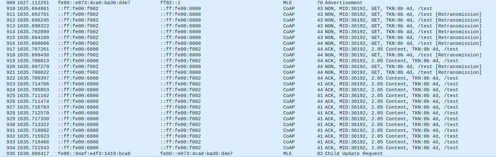

# Brouillon rapport

## Election du leader 

On remarque :  
m3-14;58c89e6bd1000621  
m3-12;30a2adacee7655df  

A l'allumage des FTD les routeurs broacasts des messages Link request pour entrer en contact avec les autres routeurs. 

Le routeur repond avec Link Request + Link Accept 

m3-12 finit l'election avec un dernier Link Accept

## Election des parents sur les noeuds END-device (avec m3-11 par exemple)

Les noeuds rejoignant le réseau commencent à broadcast *Parent request*

Puis Les routeurs ayant reçu le message précédent répondent avec Parent Response

Le noeud envoie ensuite Child ID Request au parent choisi

Enfin le parent repond avec un Child ID Response.

## Attribution des adresses (RLOC, IPv6)

L'adresse RLOC est fournie par le parent à l'envoie du message Child ID Response. 
L'IPV6 ? 
Oui 

- Dans childID request, il demande une adresse RLOC16

- Dans ChildID response il envoie l'adresse RLOC16

C'est ça 

## Question 4 : ICMPv6 

On fait un ping de tous les noeuds vers un autre et on remarque que le ping passe bien

- Exemple de commande

La capture

## Question 5 : UDP (COAP)

- Tout d'abord on crée la ressource

On résupere la ressource test dans le serveur coap crée precedement

- La capture nous montre que la communication s'est déroulé sans probleme

Non les messages ne sont pas fragementé. Ils sont juste retransmis plusieurs fois

# Question 6

Leader : 28
Router : 29

