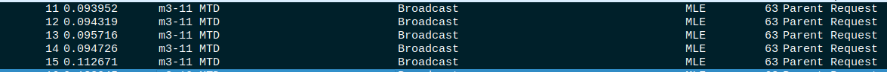
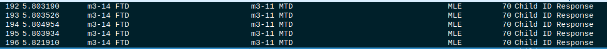
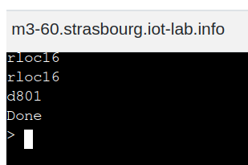
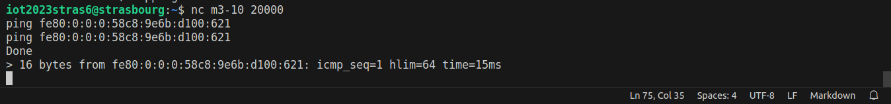
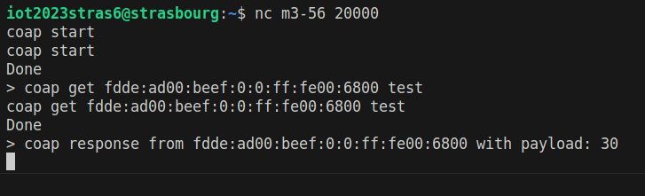

# Brouillon rapport

## Election du leader 

On remarque :  
m3-14;58c89e6bd1000621  
m3-12;30a2adacee7655df  

A l'allumage des FTD les routeurs broacasts des messages Link request pour entrer en contact avec les autres routeurs. 


Le routeur repond avec Link Request + Link Accept 


m3-12 finit l'election avec un dernier Link Accept


## Election des parents sur les noeuds END-device (avec m3-11 par exemple)

Les noeuds rejoignant le réseau commencent à broadcast *Parent request*



Puis Les routeurs ayant reçu le message précédent répondent avec Parent Response


Le noeud envoie ensuite Child ID Request au parent choisi


Enfin le parent repond avec un Child ID Response.



## Attribution des adresses (RLOC, IPv6)

L'adresse RLOC est fournie par le parent à l'envoie du message Child ID Response. 
L'IPV6 ? 
Oui 

- Dans childID request, il demande une adresse RLOC16


- Dans ChildID response il envoie l'adresse RLOC16


C'est ça 



## Question 4 : ICMPv6 

On fait un ping de tous les noeuds vers un autre et on remarque que le ping passe bien

- Exemple de commande


La capture


## Question 5 : UDP (COAP)

- Tout d'abord on crée la ressource


On résupere la ressource test dans le serveur coap crée precedement


- La capture nous montre que la communication s'est déroulé sans probleme


Non les messages ne sont pas fragementé. Ils sont juste retransmis plusieurs fois

# Question 6

Tout d'abord on commence avec la structure suivante : 
```
m3-53;child
m3-54;child
m3-56;child
m3-55;leader
m3-57;router
```

Puis on éteint le noeud leader
On remarque que 57 envoie plusieurs MLE adv, avant de detecter l'absence de leader  
*55 est éteint à partir du paquet marqué*


57 detecte l'absense de leader donc commence à envoyer des parents request


Apres quelques Data Response, les childs essayent de joindre leur encien leader mais en vain. 
Avec un Childupdaterequest


On le voit bien ici


Certains commencent alors à detecter l'absence de leader donc commencent à envoyer des parents requests


Il vont ensuite recevoir Parent response de 57, qui s'est autoproclamé leader. 


C'est alors que debute l'echange de child ID request et response


C'est ainsi que 54 deviens un child de 57 qui est à present le leader. 
On a pris l'exemple de 54 pour les captures mais c'est pareil pour les autres aussi. (53, 54 et 56)

# Question 7

[Tuto utils](https://www.iot-lab.info/learn/tutorials/riot/riot-public-ipv6-a8-m3/)