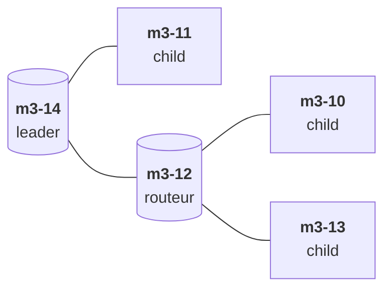

# Rapport TP2 - IOT

## 1. Compilation

Pour commencer on compile les firmwares FTD et MTD sur le channel 12 avec le PANID 0x12f0/

```bash
$ iotlab-auth -u iot2023stras6
$ git clone https://github.com/RIOT-OS/RIOT.git
$ cd RIOT
$ git checkout 2022.07
$ cd examples/openthread
$ source /opt/riot.source
$ make BOARD=iotlab-m3 OPENTHREAD_CHANNEL=12 OPENTHREAD_PANID=0x12f0 OPENTHREAD_TYPE=ftd
$ cp bin/iotlab-m3/openthread.elf openthread-ftd.elf
$ source /opt/riot.source
$ make BOARD=iotlab-m3 OPENTHREAD_CHANNEL=12 OPENTHREAD_PANID=0x12f0 OPENTHREAD_TYPE=mtd
$ cp bin/iotlab-m3/openthread.elf openthread-mtd.elf
```

Les deux binaires sont maintenant trouvable dans `~/RIOT/examples/iotlab-m3`.

## 2. Déploiement du réseau

Une fois les 5 noeuds déployés avec les bon firmawares (2 sur FTD et 3 sur MTD), on peut leur définir leur masterkey :

```bash
$ serial_aggregator
$ ifconfig down
$ thread stop 
$ masterkey 00cafedeca00deadbeaf00deafbee000
$ ifconfig up
$ thread start 
```

### a. Plan du réseau

Grace aux commandes `status ` et `child table` on peut représenter le schéma de réseau suivant :



On peut constater que les noeuds `m3-10` et `m3-13` ne se sont pas appareillés avec le leader `m3-14`, mais avec le second routeur `m3-12`. Cela peut s'expliquer simplement : la connection entre `m3-14` et  `m3-10`/`m3-13` est sans doute plus difficile, à cause des perturbations radios, ou de la distance entre eux par exemple. Et en effet, en faisant des tests avec `ping` on constate que les temps de réponses sont significativement plus lent entre `m3-14` et  `m3-10`/`m3-13`  que entre `m3-12` et  `m3-10`/`m3-13`.

### b. Établissement du réseau

On va pouvoir sniffer le réseau afin de comprendre le fonctionnement de :

1. l'election du leader
2. l'election des parents sur les noeuds End-Device
3. l'attribution des adresses (RLOC, IPv6)

Pour cela :

```bash
$ ssh iot-lab sniffer_aggregator -i 382202 -r -d -o - | wireshark -k -i -
```

On renseigne égallement la clé de décryptage `masterkey : 00cafedeca00deadbeaf00deafbee000` dans wireshark. 

