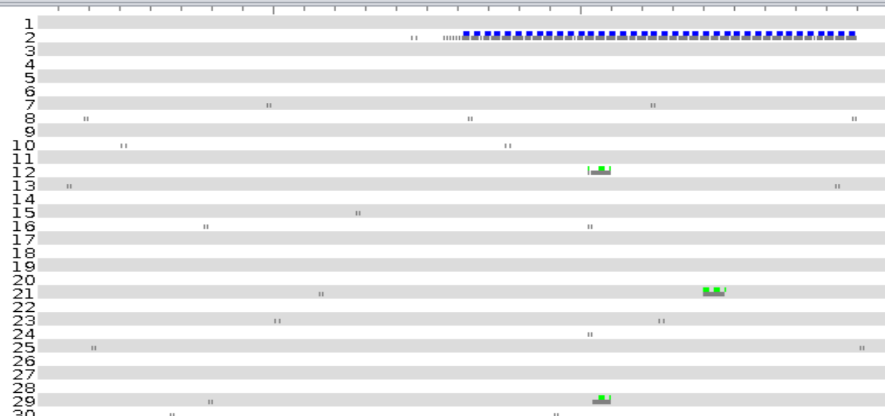
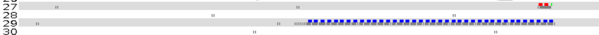
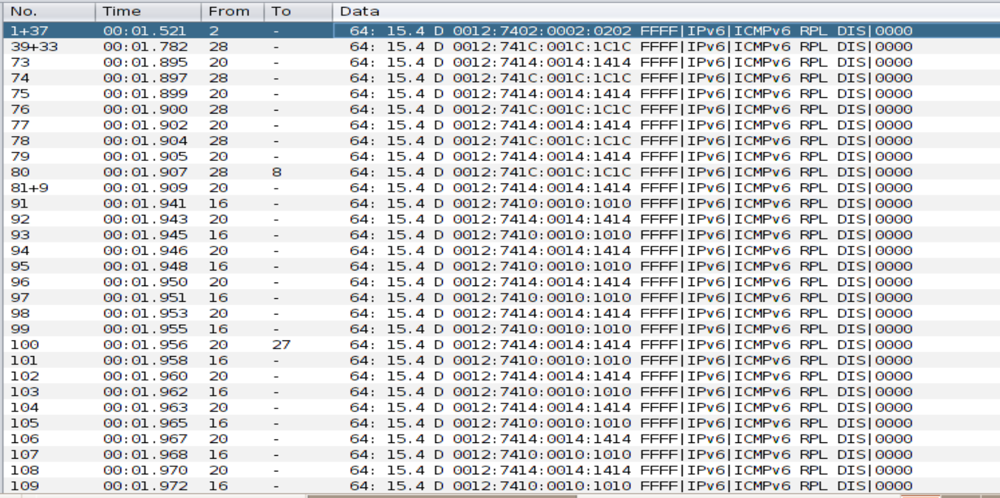
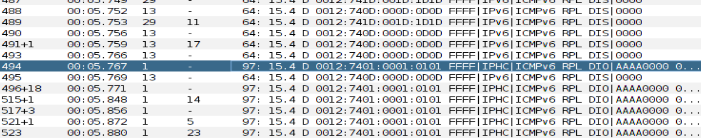
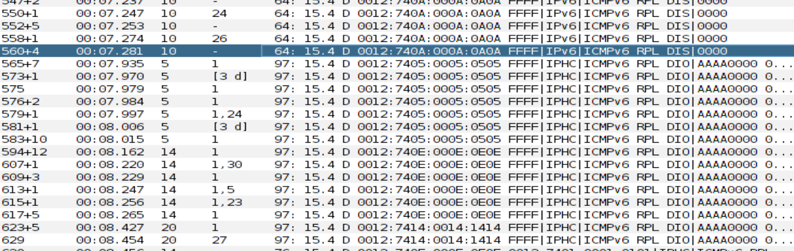
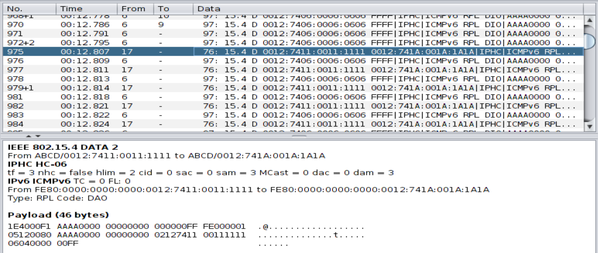

# Rapport du TP noté d'IoT

## Question 1

En examinant la fenêtre Mote output, on peut voir que l'un des paquet est étiqueté *CSMA ContikiMAC*. Le protocole utilisé est donc *CSMA ContikiMAC*. La possibilité d'ouvrir le document de recherche avec ce mot de passe nous conforte dans le fait que c'était la bonne réponse.

Avec ce genre de protocole, le problème classique est le problème de colisions. En effet, si deux noeuds parlent en même temps, les signaux vont s'interférer, rendant la lecture des deux signaux difficile.

## Question 2

Après avoir fait tourner la simulation durant 30 secondes, on peut voir que les noeuds envoient des paquets en continu, jusqu'à la reception de l'acquitement. 

Dans la figure ci-dessus, on peut voir que le noeud numéro 2 envoie des paquets en continu, jusqu'à ce que les noeuds à portée (12, 21 et 29) envoient leur acquittement respéctifs.

On peut voir en vert les acquittements. Si ils ne sont pas reçu alors que le récepteurs étaient à porté, les messages s'afficheront en rouge, comme dans la figure suivante.

Pour simuler un message envoyé, mais pas reçu, on a diminué le *success ratio* du noeud récepteur.

## Question 3

## Question 2 

La communication commence par un broacast de tous les noeuds qui broadcast DIS

La racine envoie le premier DIO. Il s'agit du noeud 1

Les autres noeuds des DIO pour que les noeuds plus bas puisse rejoindre le réseau. 

Les noeuds envoie alors un DAO à leur parent. 
Le DAO (Destination Advertisement Object) transporte des informations sur les noeuds que l’émetteur peut joindre.

Racine : 1
Rank : 256

1er à rejoindre : 5
Rank : 896

## Question 3

