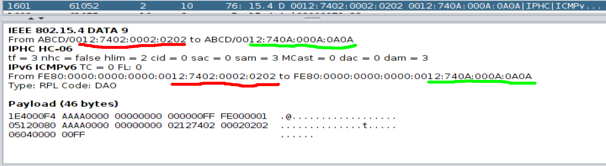
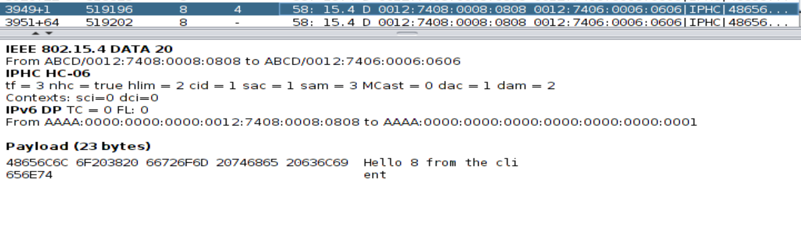

# Rapport du TP noté d'IoT

## Question 1

En examinant la fenêtre Mote output, on peut voir que l'un des paquet est étiqueté *CSMA ContikiMAC*. Le protocole utilisé est donc *CSMA ContikiMAC*. La possibilité d'ouvrir le document de recherche avec ce mot de passe nous conforte dans le fait que c'était la bonne réponse.

Avec ce genre de protocole, le problème classique est le problème de colisions. En effet, si deux noeuds parlent en même temps, les signaux vont s'interférer, rendant la lecture des deux signaux difficile.

## Question 3

Après avoir fait tourner la simulation durant 30 secondes, on peut voir que les noeuds envoient des paquets en continu, jusqu'à la reception de l'acquitement. 

Dans la figure ci-dessus, on peut voir que le noeud numéro 2 envoie des paquets en continu, jusqu'à ce que les noeuds à portée (12, 21 et 29) envoient leur acquittement respéctifs.

On peut voir en vert les acquittements. Si ils ne sont pas reçu alors que le récepteurs étaient à porté, les messages s'afficheront en rouge, comme dans la figure suivante.

  
Pour simuler un message envoyé, mais pas reçu, on a diminué le *success ratio* du noeud récepteur.

## Question 2 

La communication commence par un broacast de tous les noeuds qui broadcast DIS  

La racine envoie le premier DIO. Il s'agit du noeud 1

Les autres noeuds des DIO pour que les noeuds plus bas puisse rejoindre le réseau. 

Les noeuds envoie alors un DAO à leur parent. 
Le DAO (Destination Advertisement Object) transporte des informations sur les noeuds que l’émetteur peut joindre.

Racine : 1
Rank : 256

1er à rejoindre : 5
Rank : 896

## Question 3

On lance le la simulation pendant 1 minute avec 10 noeuds pour simplifier. Puis on regarde le rang que partage chaque noeud dans leur message DIO.

- Rank(1) = 256
- Rank(2) = 2176
- Rank(3) = 2176
- Rank(4) = 1536
- Rank(5) = 896
- Rank(6) = 896
- Rank(7) = 896
- Rank(8) = 1536
- Rank(9) = 2176
- Rank(10) = 1536

## Question 4

Les IPV6 utilisé par les noeuds : aaaa <=> FE80::::

Chaque IP est formé de la maniere suivante : FE80::::00AdresseMAC

On analyse une trame applicative : 

Les diff champs : 
- Tf = 3 : Traffic class et flow label => élidée 
- nhc = true : (prochain en tête est compréssé)
- hlim = 2 : le hop limit est à 64 
- CID (Context Identifier extention) = 1 : 8 bit de CID suit directement le DAM (Destination address mode)
- sam = 3 : L'IPv6 de la source est fe80::ff:fe00:AddrMAC
- Mcast = 0 : pas de multicast
- dam = 1 : L'Ipv6 destination est fe80::/64 + champs (champs qui correspondent au 16 bits qui suivent)

Le message envoyé : Hello 2 from the cli 

L'en-tête IPV6 ne correspond pas à une en-tête standard, Elle a été compressé -> utilisation du protocole 6Lowpan

## Question 5 
On deplace le noeud 8 afin qu'il ne soit plus à porté du noeud 6

Il essaye d'atteindre le noeud 6 : Perte

Le noeud 4 envoie un DIO à tous les noeud à proximité dont le 8 qui n'a pas reussi à joindre don parent depuis un moment.

4 est à present son nouveau parent. Il lui envoie ses données applicative. 

## Question 6

Le script compte le nombre de message reçu et envoyé pour chacun des noeuds et au total. 
Tout en calculant le (total paquet reçu / total paquet envoyé) la Qos je crois (jai pas le mot exact)

Le resultat est cohérent avec ce que nous avons affirmé à la question 1 parce que, malgré le faite que dans la simulation les liens soit 100% fiable. le PRR (total paquet reçu / total paquet envoyé) n'est pas toujours à 1 et cela ne peut s'expliqué que par des collisions

