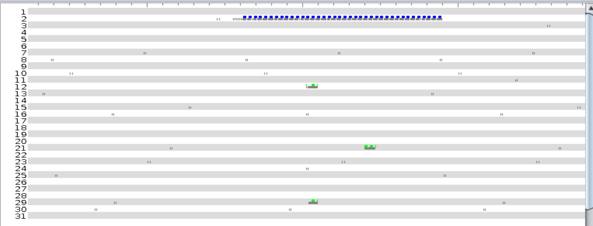
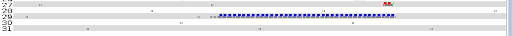

# Rapport 

## Question 1 

Protocole : CSMA ContikiMAC
Les collisions

## Question 3

On peut voir le noeud numero 2 envoie des paquets en continue jusqu'à la reception de l'ACK.

Les messages rouges c les messages pas reçu alors que le noeud est allumé en reception. 
